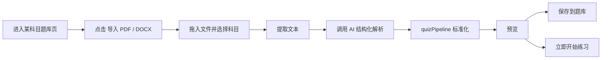
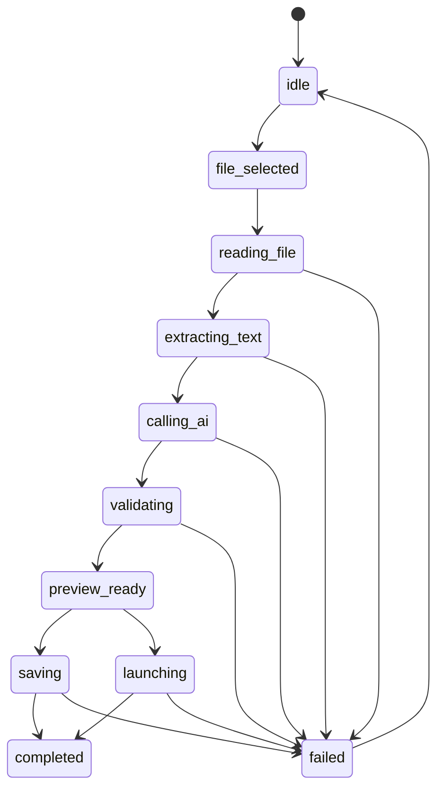

# 直接导入 PDF / DOCX 设计文档

> 当前状态：已落地到 Phase 4  
> 当前主入口：题库页 `导入 PDF / DOCX`  
> 当前次入口：`高级导入（JSON）`

## 目标

把题库导入主路径从“站外整理 JSON 后再导入”切到：

1. 用户直接拖入 `PDF / DOCX`
2. 本地提取文本并做文本层门禁
3. AI 按当前科目解析试卷结构
4. `quizPipeline` 统一校验与标准化
5. 用户在站内预览、保存到题库或立即开始练习

当前这条主链已经接到题库页；JSON 导入保留为兼容入口，不再是默认入口。

## 当前用户路径



## 当前实现状态

### 1. 文件提取层

已落地：

- [src/shared/document/pdf/extractPdfText.js](E:/VorinsFile/BaiduSyncdisk/Github项目/quiz-react-app/src/shared/document/pdf/extractPdfText.js)
- [src/shared/document/docx/extractDocxText.js](E:/VorinsFile/BaiduSyncdisk/Github项目/quiz-react-app/src/shared/document/docx/extractDocxText.js)
- [src/shared/document/buildDocumentDraft.js](E:/VorinsFile/BaiduSyncdisk/Github项目/quiz-react-app/src/shared/document/buildDocumentDraft.js)
- [src/shared/document/extractDocumentDraft.js](E:/VorinsFile/BaiduSyncdisk/Github项目/quiz-react-app/src/shared/document/extractDocumentDraft.js)
- [src/shared/document/textGate.js](E:/VorinsFile/BaiduSyncdisk/Github项目/quiz-react-app/src/shared/document/textGate.js)

职责：

- 读取文件
- 提取分页/分段文本
- 产出统一 `DocumentDraft`
- 在调用 AI 前做文本门禁

当前门禁规则：

- 文本为空或极短时直接失败
- 疑似扫描件/无文本层 PDF 不调用 AI
- 失败会落到结构化错误阶段，而不是白屏或空预览

### 2. AI 结构化导入服务

已落地：

- [src/entities/document-import/lib/documentImportContracts.js](E:/VorinsFile/BaiduSyncdisk/Github项目/quiz-react-app/src/entities/document-import/lib/documentImportContracts.js)
- [src/entities/document-import/lib/buildImportPrompt.js](E:/VorinsFile/BaiduSyncdisk/Github项目/quiz-react-app/src/entities/document-import/lib/buildImportPrompt.js)
- [src/entities/document-import/lib/buildImportPreview.js](E:/VorinsFile/BaiduSyncdisk/Github项目/quiz-react-app/src/entities/document-import/lib/buildImportPreview.js)
- [src/features/document-import/api/documentImportService.js](E:/VorinsFile/BaiduSyncdisk/Github项目/quiz-react-app/src/features/document-import/api/documentImportService.js)

当前服务主链：

```text
DocumentDraft
  -> buildImportPrompt
  -> aiGateway
  -> quizPipeline
  -> ImportDraftResult
```

当前约束：

- 不直接把原始文件发给 AI，只发提取后的文本
- 超长文档默认截取关键块，并给 `warnings`
- AI 返回后必须走 `quizPipeline`
- 失败阶段会明确区分：
  - `reading_file`
  - `extracting_text`
  - `calling_ai`
  - `validating`
  - `saving`
  - `launching`

### 3. 状态机与对话框

已落地：

- [src/features/document-import/model/useDocumentImport.js](E:/VorinsFile/BaiduSyncdisk/Github项目/quiz-react-app/src/features/document-import/model/useDocumentImport.js)
- [src/widgets/document-import/DocumentDropzone.jsx](E:/VorinsFile/BaiduSyncdisk/Github项目/quiz-react-app/src/widgets/document-import/DocumentDropzone.jsx)
- [src/widgets/document-import/DocumentImportPreview.jsx](E:/VorinsFile/BaiduSyncdisk/Github项目/quiz-react-app/src/widgets/document-import/DocumentImportPreview.jsx)
- [src/widgets/document-import/DocumentImportDialog.jsx](E:/VorinsFile/BaiduSyncdisk/Github项目/quiz-react-app/src/widgets/document-import/DocumentImportDialog.jsx)

当前状态流：



当前 UI 已支持：

- 拖拽和点击选文件
- 显式选科目
- 解析进度日志
- 题量/总分/题型统计预览
- warning / error / invalidReasons 展示
- `保存到题库`
- `立即开始练习`

### 4. 题库页主入口

已落地：

- [src/pages/FileHubPage.jsx](E:/VorinsFile/BaiduSyncdisk/Github项目/quiz-react-app/src/pages/FileHubPage.jsx)
- [src/features/file-hub/model/useFileHubPageState.js](E:/VorinsFile/BaiduSyncdisk/Github项目/quiz-react-app/src/features/file-hub/model/useFileHubPageState.js)

当前入口排列：

1. `导入 PDF / DOCX`
2. `AI 生成题目`
3. `高级导入（JSON）`

当前保存规则：

- `保存到题库`：写入 `libraryRepository`
- `立即开始练习`：复用同一次保存结果，不重复保存第二次

## 当前数据模型

### DocumentDraft

```json
{
  "fileName": "英语模拟卷九.pdf",
  "mimeType": "application/pdf",
  "subject": "english",
  "rawText": "...",
  "pages": [
    { "page": 1, "text": "..." }
  ],
  "paragraphs": [
    { "page": 1, "text": "..." }
  ],
  "outline": []
}
```

### ImportDraftResult

```json
{
  "requestId": "import_001",
  "documentDraft": {},
  "rawAiPayload": {},
  "normalizedDocument": {},
  "scoreBreakdown": {},
  "preview": {},
  "warnings": [],
  "errors": [],
  "invalidReasons": []
}
```

## 预览与保存规则

当前准入规则已经固定：

- 只有 `warnings`：允许保存
- 存在 `errors`：不允许保存
- 存在阻断型 `invalidReasons`：不允许保存
- `立即开始练习` 必须复用上一步保存结果

## 与旧 JSON 导入的关系

当前状态不是“删除 JSON”，而是：

- `PDF / DOCX` 直导入：主路径
- `高级导入（JSON）`：兼容与调试路径

这意味着：

- 旧 JSON 导入链仍可用
- `quizPipeline` 仍然是导入标准化主入口
- 现有题库、旧 `items` 兼容、手工 JSON 维护场景都不会被立即破坏

## 已有回归

当前已经有：

- 文档提取层测试
- 文档导入服务测试
- `useDocumentImport` 状态机测试
- 对话框组件测试
- 题库页接入测试
- 页面级 smoke：
  - 打开对话框
  - 选择文件
  - 解析预览
  - 保存到题库
  - 立即开始练习

## 当前限制

当前仍是 MVP，有这些明确限制：

1. 不支持 OCR  
   扫描版 PDF / 纯图片 PDF 仍然会被门禁拦截。

2. 超长文档默认截取关键块  
   这是为了控制 token 成本和超时风险，不是最终最优的分段策略。

3. 预览目前只支持“看结果再保存”  
   还没有题目级手工修订 UI。

4. 首页主入口尚未切到文件直导入  
   当前主路径是在题库页里生效，而不是首页。

## 后续增强优先级

当前主链已经在题库页可用，后续增强优先级如下：

1. OCR / 图片 PDF 识别
2. 更细粒度的长文档分段
3. 题目级预览修订
4. 导入后自动核题
