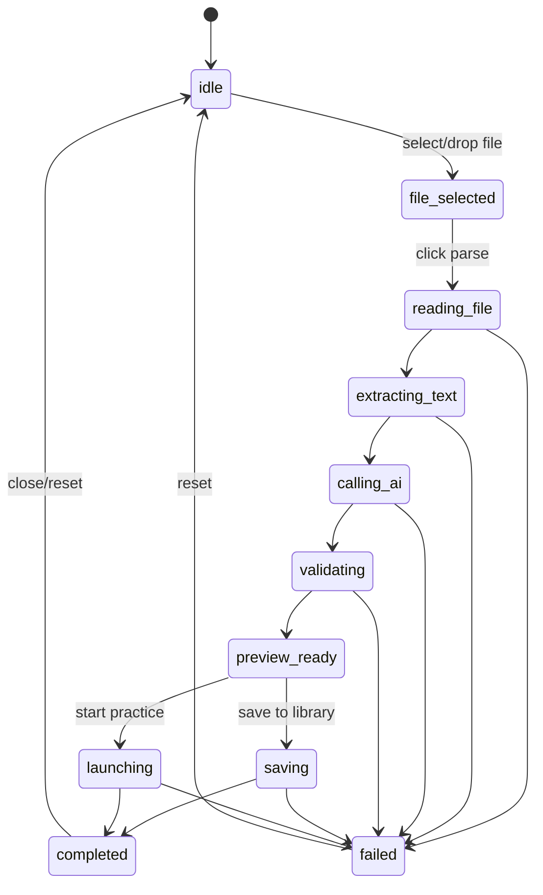
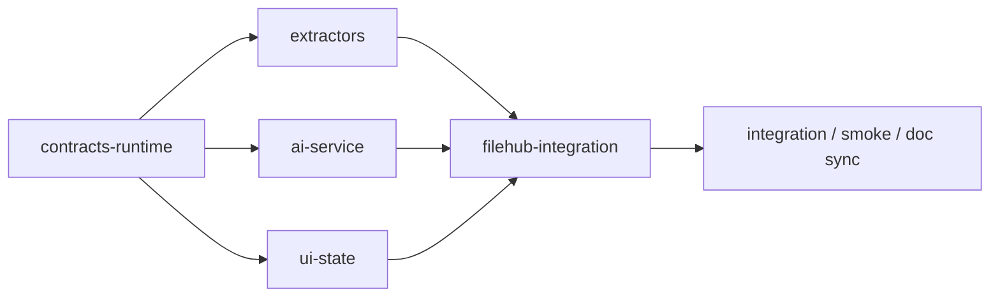

# 直接导入 Phase 1 设计稿（红队修正版）

本文是 [direct-import-design.md](E:\VorinsFile\BaiduSyncdisk\Github项目\quiz-react-app\docs\direct-import-design.md) 的实施级补充，目标不是讨论愿景，而是给第一版 `PDF / DOCX -> 文本 -> AI -> quizPipeline -> 题库` 一个可以直接分发给多个开发分支的安全执行方案。

本稿相对初版补进了 4 类红队约束：

1. 先冻结共享契约，避免 UI 分支和服务分支各写各的
2. 本地先做文本层检测，禁止空文本直接烧 AI token
3. 明确长文档的分段策略，不允许默认整份全文直发
4. 明确保存/开刷的事务边界，避免重复保存和状态漂移

## 1. 入口位置

Phase 1 不新开页面，入口继续放在：

- [src/pages/FileHubPage.jsx](E:\VorinsFile\BaiduSyncdisk\Github项目\quiz-react-app\src\pages\FileHubPage.jsx)

题库页顶部操作区建议改成：

```text
[导入 PDF / DOCX] [AI 生成题目] [高级导入（JSON）] [返回首页]
```

其中：

- `导入 PDF / DOCX` 是新的主入口
- `高级导入（JSON）` 保留为兼容入口，不再是默认入口
- `AI 生成题目` 保留

## 2. UI 草图

### 2.1 初始态

```text
+-------------------------------------------------------------------+
| 导入 PDF / DOCX                                                   |
| 将试卷文件拖到这里，或点击选择文件                                |
| 支持：PDF（文本层） / DOCX                                        |
|                                                                   |
| [选择文件]                      [高级导入（JSON）]                |
+-------------------------------------------------------------------+
```

要求：

1. 明确告诉用户当前只支持文本层 PDF 和普通 DOCX
2. JSON 放在次入口，不抢主入口
3. 初始态就提示“文件内容会发送给 AI 解析”

### 2.2 文件已选中

```text
+-------------------------------------------------------------------+
| 已选择文件                                                        |
| 英语模拟卷九.pdf                                                  |
| 2.4 MB · PDF                                                      |
|                                                                   |
| 科目： [英语 v]                                                   |
|                                                                   |
| [开始解析] [重新选择文件]                                         |
+-------------------------------------------------------------------+
```

要求：

1. 用户必须确认科目
2. 第一版不做自动锁定科目
3. 可以切科目，避免按错协议解析

### 2.3 解析中

```text
+-------------------------------------------------------------------+
| 正在解析试卷                                                      |
| Step 1/4 已读取文件                                               |
| Step 2/4 已提取文本                                               |
| Step 3/4 AI 正在结构化题目                                        |
| Step 4/4 正在校验题库结构                                         |
|                                                                   |
| 进度日志                                                          |
| - 文件读取完成                                                    |
| - 共提取 8 页文本                                                 |
| - 已发送给 AI                                                     |
|                                                                   |
| [取消导入]                                                        |
+-------------------------------------------------------------------+
```

要求：

1. 明确分阶段，不要只有一个“加载中”
2. 失败时必须指出卡在哪一步
3. 解析中必须显示“是否已通过文本层检测”

### 2.4 预览态

```text
+-------------------------------------------------------------------+
| 导入预览                                                          |
| 标题：2026 英语模拟卷九                                           |
| 科目：英语    题量：44    总分：150                               |
|                                                                   |
| 题型统计                                                          |
| - 单项选择：15                                                    |
| - 完形填空：1                                                     |
| - 阅读理解：4                                                     |
| - 翻译：2                                                         |
| - 作文：1                                                         |
|                                                                   |
| 预览状态                                                          |
| - 通过：40                                                        |
| - 警告：4                                                         |
| - 无效：0                                                         |
|                                                                   |
| [保存到题库] [立即开始练习] [放弃导入]                            |
+-------------------------------------------------------------------+
```

要求：

1. 预览必须发生在保存前
2. 第一版不做在线编辑题目
3. 必须显式展示 `warnings / invalid`
4. UI 要遵守保存准入规则：
   - 仅有 warnings：可保存
   - 存在 errors 或 invalid 阻断项：不可保存

### 2.5 失败态

```text
+-------------------------------------------------------------------+
| 导入失败                                                          |
| 当前文件无法解析成可用题库                                        |
|                                                                   |
| 失败阶段：extracting_text                                          |
| 原因：未提取到足够文本，文件可能是扫描件或图片 PDF                 |
|                                                                   |
| 建议：                                                            |
| - 检查 PDF 是否可复制文本                                         |
| - 更换为 DOCX                                                     |
| - 使用 OCR 后再导入                                               |
| - 使用高级导入（JSON）                                            |
|                                                                   |
| [重新选择文件] [查看原始文本] [关闭]                              |
+-------------------------------------------------------------------+
```

要求：

1. 错误信息必须结构化
2. 不能只给“导入失败”
3. 失败阶段至少区分：
   - `reading_file`
   - `extracting_text`
   - `calling_ai`
   - `validating`
   - `saving`
   - `launching`

## 3. 状态机



### 状态定义

- `idle`: 初始态，无文件
- `file_selected`: 已选择文件，等待开始解析
- `reading_file`: 正在读取二进制文件
- `extracting_text`: 正在提取 PDF / DOCX 文本
- `calling_ai`: 正在把提取文本发给 AI
- `validating`: 正在走 `quizPipeline`
- `preview_ready`: 已得到预览结果
- `saving`: 正在写入题库
- `launching`: 正在进入工作区
- `completed`: 导入链已结束
- `failed`: 任一阶段失败

### 状态迁移原则

1. 任一失败都必须有明确的 `failedStage`
2. 只有 `preview_ready` 才允许保存或开刷
3. `launching` 前必须先得到 `paperId`
4. `startPracticeWithImportedPaper` 不得再次重复保存一份新题库

## 4. 共享契约先冻结

这一步是红队修正版新增的前置约束。UI、服务、接入三条线不能同时各写一套数据结构。

建议先新增：

- `src/entities/document-import/lib/documentImportContracts.js`

至少冻结这些结构：

```ts
type FailedStage =
  | ''
  | 'reading_file'
  | 'extracting_text'
  | 'calling_ai'
  | 'validating'
  | 'saving'
  | 'launching'

type ImportPreview = {
  title: string
  subject: string
  questionCount: number
  totalScore: number
  validCount: number
  warningCount: number
  invalidCount: number
  typeStats: Array<{ type: string; label: string; count: number }>
}

type ImportDraftResult = {
  requestId: string
  documentDraft: DocumentDraft
  rawAiPayload: unknown
  normalizedDocument: ReturnType<typeof normalizeQuizDocument>
  scoreBreakdown: ReturnType<typeof getQuizScoreBreakdown>
  preview: ImportPreview
  warnings: string[]
  errors: string[]
  invalidReasons: string[]
}
```

## 5. DocumentImportDialog 接口设计

建议新增：

- [src/widgets/document-import/DocumentImportDialog.jsx](E:\VorinsFile\BaiduSyncdisk\Github项目\quiz-react-app\src\widgets\document-import\DocumentImportDialog.jsx)

### Props

```ts
type DocumentImportDialogProps = {
  open: boolean
  subjectMeta: SubjectMeta
  state: DocumentImportState
  onClose: () => void
  onFileSelect: (file: File) => void
  onSubjectChange: (subjectKey: string) => void
  onStartImport: () => void
  onCancelImport: () => void
  onReset: () => void
  onSaveImportedPaper: () => Promise<void>
  onStartPracticeWithImportedPaper: () => Promise<void>
}
```

### 组件职责

1. 展示拖拽区
2. 展示进度
3. 展示预览
4. 提供保存 / 开刷按钮
5. 明示“将发送给 AI 解析”的用户提示

### 组件不负责

1. 文件读取
2. 文本提取
3. AI 调用
4. 题库保存

这些都放在 `feature hook` 和 `service`。

## 6. useDocumentImport 接口设计

建议新增：

- [src/features/document-import/model/useDocumentImport.js](E:\VorinsFile\BaiduSyncdisk\Github项目\quiz-react-app\src\features\document-import\model\useDocumentImport.js)

### State

```ts
type DocumentImportState = {
  open: boolean
  status:
    | 'idle'
    | 'file_selected'
    | 'reading_file'
    | 'extracting_text'
    | 'calling_ai'
    | 'validating'
    | 'preview_ready'
    | 'saving'
    | 'launching'
    | 'completed'
    | 'failed'
  file: File | null
  fileMeta: {
    name: string
    size: number
    mimeType: string
  } | null
  subject: string
  extractedText: string
  documentDraft: DocumentDraft | null
  importResult: ImportDraftResult | null
  preview: ImportPreview | null
  progressLog: string[]
  warnings: string[]
  errors: string[]
  failedStage: FailedStage
  canSave: boolean
  canStartPractice: boolean
  saveResult: {
    paperId: string
    title: string
  } | null
}
```

### Actions

```ts
type UseDocumentImport = {
  state: DocumentImportState
  setOpen: (open: boolean) => void
  setSubject: (subjectKey: string) => void
  selectFile: (file: File) => void
  startImport: () => Promise<void>
  cancelImport: () => void
  resetImport: () => void
  saveImportedPaper: () => Promise<{ paperId: string } | null>
  startPracticeWithImportedPaper: () => Promise<{ paperId: string } | null>
}
```

### Hook 依赖

`useDocumentImport` 应依赖：

1. `extractPdfText / extractDocxText`
2. `documentImportService`
3. `libraryRepository`
4. `navigate`

## 7. 服务层设计

建议新增：

- [src/features/document-import/api/documentImportService.js](E:\VorinsFile\BaiduSyncdisk\Github项目\quiz-react-app\src\features\document-import\api\documentImportService.js)

### Service 输入

```ts
type StartDocumentImportParams = {
  file: File
  subject: string
  titleHint?: string
}
```

### Service 输出

```ts
type StartDocumentImportResult = {
  requestId: string
  documentDraft: DocumentDraft
  rawAiPayload: unknown
  normalizedDocument: ReturnType<typeof normalizeQuizDocument>
  preview: ImportPreview
  warnings: string[]
  errors: string[]
}
```

### 服务内部顺序

1. 读取文件
2. 提取文本
3. 做文本层门禁检测  
   如果提取文本长度不足或基本全空，直接失败，禁止调用 AI
4. 构造 `DocumentDraft`
5. 根据长度和页数决定是否分段
6. 构造 AI prompt
7. 调 `aiGateway`
8. 获取 AI 返回题库 payload
9. 调 `quizPipeline`
10. 构造预览结果

### 硬规则

1. 默认不能把整份长文档全文直接发给 AI
2. 必须定义分段策略：
   - 页数阈值
   - 字数阈值
   - section 分段策略
3. 需要把分段信息写入 `progressLog`

## 8. PDF / DOCX -> 文本 -> AI -> quizPipeline 任务拆分单（红队修正版）

### 任务组 A：共享契约与运行时前提

目标：  
冻结共享类型，并提前处理 `pdfjs-dist` 运行时和文本层门禁。

建议文件：

- `src/entities/document-import/lib/documentImportContracts.js`
- `src/shared/document/pdf/pdfRuntime.js`
- `src/shared/document/detectTextLayer.js`

任务：

1. 冻结 `DocumentDraft / ImportDraftResult / ImportPreview / FailedStage`
2. 接好 `pdfjs-dist` 在 Vite + GitHub Pages 下的 worker 运行方式
3. 实现文本层检测：
   - 空文本
   - 极短文本
   - 乱码文本
4. 明确 `extracting_text` 阶段失败的错误对象

验收：

1. `pdfjs-dist` 在浏览器环境可稳定运行
2. 空文本文件不会继续进入 AI 阶段
3. 所有后续任务复用同一套共享契约

### 任务组 B：文件提取

目标：  
建立可复用的 PDF / DOCX 文本提取层。

建议文件：

- `src/shared/document/pdf/extractPdfText.js`
- `src/shared/document/docx/extractDocxText.js`
- `src/shared/document/buildDocumentDraft.js`

任务：

1. 接入 `pdfjs-dist`
2. 接入 `mammoth`
3. 统一输出 `DocumentDraft`
4. 区分错误：
   - 文件读取失败
   - 文本提取失败
   - 文本层缺失

验收：

1. 能从文本层 PDF 中提取页文本
2. 能从 DOCX 中提取段落文本
3. 能返回统一 `DocumentDraft`

### 任务组 C：AI 协议

目标：  
把试卷文本转成 AI 可稳定解析的输入协议。

建议文件：

- `src/entities/document-import/lib/buildImportPrompt.js`
- `src/entities/document-import/lib/documentImportContracts.js`

任务：

1. 设计 `parse_exam_paper` 协议
2. 根据科目能力模型限制题型
3. 对英语阅读 / 完型 / 综合题写入明确 contract
4. 设计长文本分段策略
5. 设计隐私提示文案

验收：

1. Prompt 不掺杂页面展示文案
2. 能按科目切换题型约束
3. AI 输出目标与 `quizPipeline` 兼容
4. 支持分段解析，而不是默认整份全文直发

### 任务组 D：导入服务

目标：  
打通“文件 -> AI -> quizPipeline”的主链。

建议文件：

- `src/features/document-import/api/documentImportService.js`

任务：

1. 读取 `DocumentDraft`
2. 调 `aiGateway`
3. 调 `normalizeQuizDocument`
4. 产出 `preview`
5. 返回结构化错误
6. 定义保存准入规则：
   - `warnings` 可保存
   - `errors` 不可保存
   - `invalid` 题是否剔除必须写死

验收：

1. 失败能指出阶段
2. 预览可读
3. 可输出 `normalizedDocument`
4. 保存准入规则明确

### 任务组 E：UI 与状态机

目标：  
落地拖拽导入对话框与状态机。

建议文件：

- `src/widgets/document-import/DocumentDropzone.jsx`
- `src/widgets/document-import/DocumentImportDialog.jsx`
- `src/widgets/document-import/DocumentImportPreview.jsx`
- `src/features/document-import/model/useDocumentImport.js`

任务：

1. 拖拽区
2. 文件选择后显示文件元信息
3. 解析进度日志
4. 预览结果
5. 保存 / 开刷
6. AI 发送前隐私提示

验收：

1. UI 状态切换稳定
2. 失败态不白屏
3. 保存 / 开刷按钮只在 `preview_ready` 可点
4. 开刷前必须已拿到保存后的 `paperId`

### 任务组 F：题库页接入

目标：  
把文件导入接进当前题库页。

建议改动：

- [src/pages/FileHubPage.jsx](E:\VorinsFile\BaiduSyncdisk\Github项目\quiz-react-app\src\pages\FileHubPage.jsx)
- [src/features/file-hub/model/useFileHubPageState.js](E:\VorinsFile\BaiduSyncdisk\Github项目\quiz-react-app\src\features\file-hub\model\useFileHubPageState.js)

任务：

1. 增加 `导入 PDF / DOCX`
2. JSON 导入降级成高级入口
3. 复用当前题库保存链
4. 复用当前开刷跳转链
5. `saveImportedPaper` 和 `startPracticeWithImportedPaper` 必须共用同一次保存结果

验收：

1. 文件直导入成为主入口
2. JSON 仍可从高级入口进入
3. 保存后在题库列表中可见
4. 立即开始练习不会重复保存第二次

### 任务组 G：测试

目标：  
给新链路补 smoke 和核心单测。

建议新增：

- `src/shared/document/pdf/extractPdfText.test.js`
- `src/shared/document/docx/extractDocxText.test.js`
- `src/features/document-import/api/documentImportService.test.js`
- `src/features/document-import/model/useDocumentImport.test.jsx`
- `src/tests/document-import.smoke.test.jsx`

覆盖链路：

1. 选择文件
2. 文本提取
3. 文本层检测
4. AI 返回题库 payload
5. 走 `quizPipeline`
6. 预览
7. 保存到题库
8. 立即开始练习

## 9. 推荐并行拓扑

红队修正版不建议一开始就 4 路平推。

建议顺序：

1. `contracts-runtime`
2. `extractors`
3. `ai-service`
4. `ui-state`
5. `filehub-integration`
6. `integration`

并行关系：



## 10. Phase 1 范围边界

Phase 1 必须做：

1. PDF 文本层提取
2. DOCX 文本提取
3. 拖拽导入 UI
4. AI 结构化
5. `quizPipeline`
6. 预览
7. 保存 / 开刷

Phase 1 不做：

1. 扫描件 OCR
2. 图片试卷识别
3. “试卷 + 解析”双文件联合导入
4. 预览内在线编辑题目
5. 批量导入多个文件

## 11. 结论

红队修正版的核心不是把方案推翻，而是把这几条补硬：

1. **共享契约先冻结**
2. **文本层检测先于 AI**
3. **长文档默认分段，不许全文裸发**
4. **保存/开刷复用同一次持久化结果**
5. **warnings / errors / invalid 的保存规则必须提前写死**

这样做，才能在不破坏现有题库和工作区链路的前提下，把用户体验从“先手工做 JSON”升级成“直接拖试卷文件导入”。
