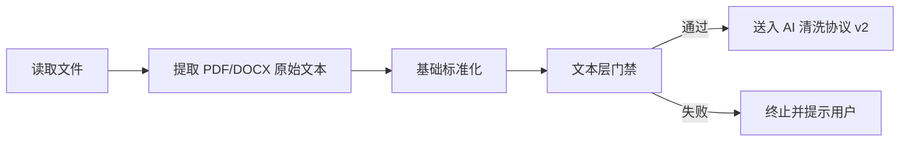
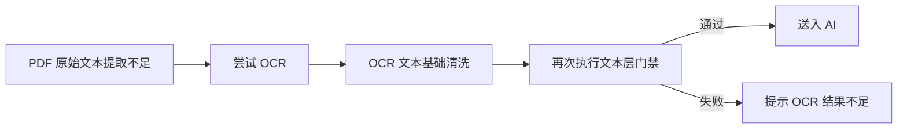

# 英语 OCR / PDF 清洗前置规则

> 适用范围：英语试卷的 `PDF / 图片 PDF / OCR PDF / DOCX` 直导入主链  
> 作用阶段：`文件读取 -> 文本提取 -> 文本层门禁 -> AI 清洗协议 v2`

本文件约束的是**文本提取层**，不是 AI 结构化层。目标是在文本送入 AI 之前，尽量先把显而易见的脏数据问题处理掉，并在无法处理时尽早阻断。

## 1. 目标

前置清洗层的目标不是“把试卷完全结构化”，而是：

1. 提取尽可能完整的原始文本
2. 修复明显的 OCR / PDF 文本污染
3. 保留题号、选项、段落和题型边界
4. 在文本质量明显不足时阻断 AI 调用，避免白烧 token

## 2. 支持输入

1. 带文本层的 PDF
2. 图片型 PDF 或扫描件 PDF
3. DOCX

其中：

1. 带文本层 PDF：优先走直接文本提取
2. 图片型 PDF / 扫描件：优先检测文本层是否不足，若不足再走 OCR
3. DOCX：直接提取段落文本

## 3. 前置处理顺序

如果是 PDF，且提取文本明显不足，则：

## 4. 基础标准化规则

这一步不做题型识别，只做通用文本卫生处理。

### 4.1 换行统一

1. 统一成 `\n`
2. 把连续 3 个以上空行压缩成 2 个
3. 清理行尾多余空格

### 4.2 空白字符统一

1. 把 `NBSP`、制表符统一成普通空格
2. 清理连续多空格
3. 保留必要的段落间隔

### 4.3 标点统一

1. 统一全角 / 半角括号
2. 统一中英文冒号、逗号、句号的混用
3. 保留题号后面的真实分隔符语义

## 5. 中文乱码清洗规则

### 5.1 允许修复

1. 明显的 UTF-8 / GBK 错码残留
2. OCR 导致的零碎中文乱码
3. 被打断的短中文片段

### 5.2 禁止行为

1. 没有上下文依据时整句重写
2. 凭空“脑补”题意
3. 用通顺句子替换原题而丢失原卷信息

### 5.3 处理原则

1. 能局部修就不整段重写
2. 修完后仍不确定的，保留原文并交给 AI 清洗层保守处理
3. 结构边界比措辞润色更重要

## 6. 异常标点清洗规则

### 6.1 常见污染

1. `A．`、`A.`、`A、`、`A)` 混用
2. 中文句号和英文句号混用
3. 双引号、单引号、破折号、括号被 OCR 错识别

### 6.2 清洗原则

1. 保留语义，不保留噪音
2. 不要把题号、选项字母、分值标识清掉
3. 对阅读、完形、翻译正文中的普通标点，只做最小必要修复

## 7. 选项字母错位清洗规则

### 7.1 必须识别的情况

1. `A.` / `A)` / `A、`
2. `B.` / `B)` / `B、`
3. OCR 把 `B` 识别成 `8`
4. OCR 把 `D` 识别成 `0`
5. OCR 把 `C` 识别成 `(` 或其他相似字符

### 7.2 清洗策略

1. 当上下文明确是四选一结构时，优先恢复为 `A/B/C/D`
2. 只在结构非常明确时纠正
3. 如果上下文不明确，不要强行猜

### 7.3 必须保留

1. 选项顺序
2. 选项文本内容
3. 选项与题干的从属关系

## 8. 空格和换行污染清洗规则

### 8.1 允许修复

1. 同一句被不合理换行打断
2. 题干与选项跨页断开但仍可明确连接
3. 阅读材料中被拆碎的普通段落
4. 翻译正文和作文要求中的异常断行

### 8.2 禁止修复

1. 把相邻两题合并成一题
2. 把不同 section 合并
3. 把阅读材料正文和题目说明混在一起

### 8.3 特别规则

1. 完形填空正文要尽量保持连续段落
2. 阅读理解一篇文章内部可合并断行，但不同篇 `A/B/C/D` 不能混
3. 翻译题正文和题目方向要分开保留

## 9. 文本层门禁规则

文本在进入 AI 前，至少应经过以下门禁：

1. `plain_text` 不能是空
2. 有效非空白字符数不能低于最低阈值
3. 有效行数不能低于最低阈值
4. 对 PDF：
   - 如果总页数很多，但有文本页极少，判定为疑似扫描件
   - 疑似扫描件时应先尝试 OCR，再决定是否失败

### 9.1 允许进入 AI 的情况

1. 提取到足够文本
2. OCR 后文本质量达到最低门禁

### 9.2 必须阻断的情况

1. 基本未提取到任何文本
2. OCR 后仍只有极短碎片
3. 明显只有封面或目录，没有题目正文

## 10. 面向英语题型的专项前置规则

### 10.1 单选

1. 优先保留题号与四个选项的边界
2. 不要因为清洗换行把选项并进题干

### 10.2 完形

1. 必须尽量保留整篇文章连续性
2. 优先保留每空附近的原句语境
3. 如果原文中已存在空位编号，不得清洗掉

### 10.3 阅读理解

1. 一篇文章内部可修复段落断裂
2. 不得把 `Passage A/B/C/D` 混在一起
3. 子题与文章边界必须尽量保留

### 10.4 翻译

1. 保留原文正文
2. 保留方向提示，如“英译中 / 中译英 / Translate ...”

### 10.5 作文

1. 保留写作要求、标题、字数要求、体裁要求
2. 不要只保留标题而丢掉说明

## 11. 失败提示建议

如果在前置清洗层失败，应优先给用户明确原因，而不是直接说“导入失败”。

推荐提示：

1. `当前 PDF 可能是扫描件或图片 PDF，系统已尝试 OCR，但仍未提取到足够文本。`
2. `当前文件提取到的文本过短，暂时无法交给 AI 解析。`
3. `当前文件只提取到封面或目录，未检测到足够试题正文。`

## 12. 一句话原则

英语 OCR / PDF 清洗前置规则的核心原则是：

**先尽可能保住结构边界，再去做最小必要的文本修复；如果连“可解析的题目文本”都拿不到，就应在 AI 之前失败，而不是把脏文本直接丢给模型。**
